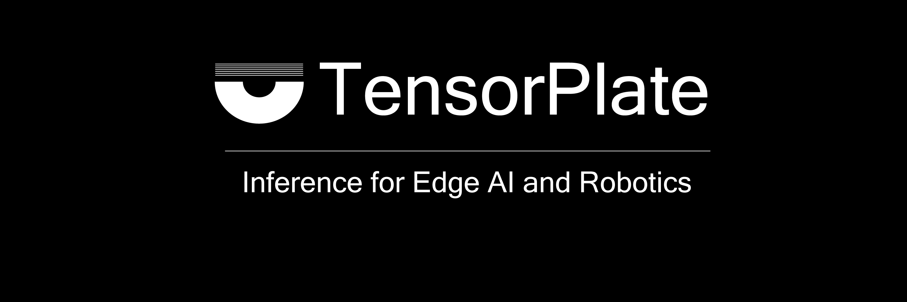

<p align="center">
  
</p>

# TensorPlate

TensorPlate is an inference platform for edge AI and robotics. It is designed for reliable, observable model serving on hardware-constrained devices, with a C++ runtime hot path and Rust control-plane components.

> Status: release-candidate preparation for v0.1.0. The release tooling,
> package skeleton, validation reports, and external install docs are in
> place; the final public release must still be cut from a clean
> `release/v0.1.0` branch and annotated `v0.1.0` tag.

## What TensorPlate Is

TensorPlate is intended to provide:

- A hardware-adjacent inference runtime for devices such as Jetson and Kria-class edge systems.
- A serving worker with explicit lifecycle, readiness, and health contracts.
- A Rust device agent for deployment, rollback, supervision, and desired-state reconciliation.
- Adapter-based backend support for runtimes such as TensorRT and PyTorch/LibTorch.
- A test strategy that separates unit, integration, adapter contract, hardware-in-loop, and benchmark validation.

## Architecture Principles

TensorPlate contributions should preserve these core constraints:

- Runtime hot-path and serving-worker code is C++20.
- Device agent, observability, and CLI code is Rust.
- Python SDK code is a thin HTTP API wrapper.
- Runtime behavior that varies by deployment belongs in config.
- Fallible hardware-boundary operations return `Result<T>`.
- Cross-layer payloads use value objects and `BufferRef` / `TensorView`.
- Hardware resources are owned through RAII wrappers inside adapter internals.
- Dependencies flow downward through the runtime layers.

See [CONTRIBUTING.md](CONTRIBUTING.md) for the working contribution contract.

## Repository Layout

```text
include/tensorplate/         Public C++ headers
runtime/                     Core inference runtime (C++20)
serving_worker/              Data-plane worker process (C++20)
backends/python_pytorch/     Out-of-process Python/PyTorch backend
agent/                       Rust device agent
cli/                         Rust operator CLI
observability/               Rust independent health monitor
protocol/schemas/            Language-neutral cross-component schemas
protocol/rust/               Rust protocol crate consuming the schemas
config/schemas/              Deployment and runtime config schemas
test/                        Unit, integration, contract, HIL, and benchmark tests
cmake/                       CMake toolchains, modules, and feature flags
docs/                        Public architecture and contributing docs
```

See [`docs/architecture/ownership.md`](docs/architecture/ownership.md) for
package owners, allowed dependencies, and review gates.

## Getting Started

For development:

1. Read [CONTRIBUTING.md](CONTRIBUTING.md).
2. Follow [local validation](docs/contributing/local-validation.md).
3. Keep public behavior, interface, config schema, feature flag, and error-code changes reflected in [CHANGELOG.md](CHANGELOG.md).

For the v0.1.0 external install path, start with
[docs/install/external-install.md](docs/install/external-install.md)
after the `v0.1.0` GitHub Release is published. The release process and
tag policy live under [docs/release/](docs/release/).

## Contributing

Issues are organized as:

- Epic: a roadmap outcome.
- Feature: a deliverable slice under an Epic.
- Task: a concrete implementation, test, documentation, or validation item under a Feature.
- Bug: incorrect behavior, regression, crash, or contract violation.

Pull requests should link an issue, describe acceptance criteria coverage, include test evidence, and note changelog impact.

Branches names should be named after issues: 'git checkout -b issue-##'

For features, issues are implemented at tasks issues levels then merged into feature branch.

For bugs, issues can be merged directly into 'develop' or 'feature' branch.

Release branches use `release/vX.Y.Z` and final public release tags use
annotated `vX.Y.Z` tags. Retagging a published final release is forbidden;
see [docs/release/version-tag-policy.md](docs/release/version-tag-policy.md).

## Security

Please do not report security issues through public GitHub issues. See [SECURITY.md](SECURITY.md).

## License

TensorPlate is licensed under the Apache License 2.0. See [LICENSE](LICENSE).
